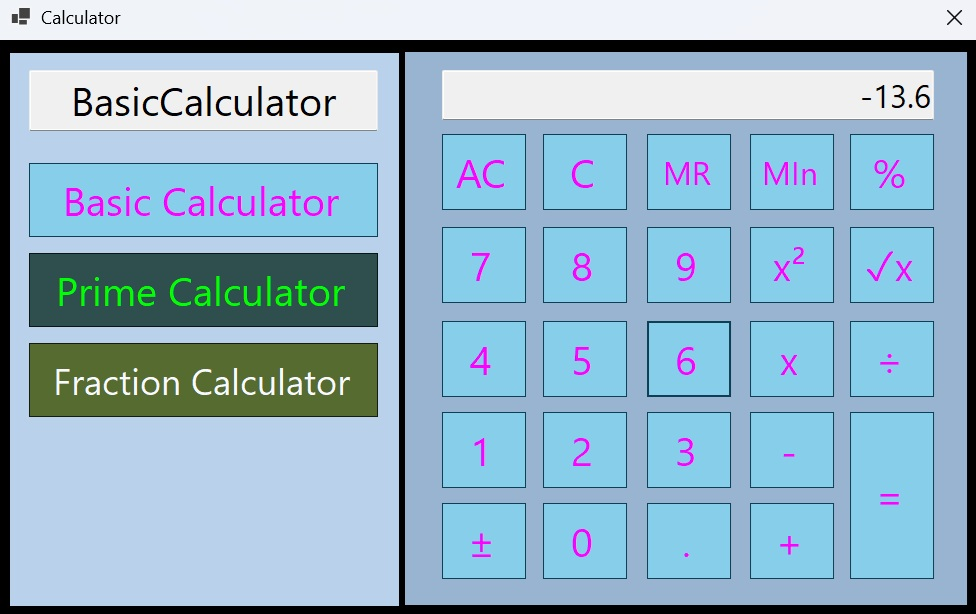

## 🧮 Calculator Suite 🧮

A suite of calculators with different functionality, including for basic calculation, prime numbers and fractions.

## ⚙️ Tech stack:

| Component          | Technology / Version         |
|-------------------|----------------------------|
| Framework          | .NET 10                    |
| Language           | C#                         |
| UI Technology      | WinForms                   |
| IDE / Editor       | Visual Studio 2026         |
| Version Control    | Git / GitHub               |
| Target Platform    | Windows Desktop            |

## 🎯 Aims:

Along with my Noughts and Crosses game, this was one of the first applications I made.
It began using a tutorial to create a calculator in WinForms before I developed the idea further with additional functionality.
I have been working on updating (and completing) this application with a cleaner UI and use of algorithms to improve performance.

My original aims were:
- Move from console apps to a simple UI using WinForms.
- Explore what calculations are possible using C#.
- Begin reading up on different algorithms.
- Create a fully functional application.

## ✨ Features:

- Simple UI using WinForms designer (and increasingly adapting generated code for better precision).
- Static classes featuring custom-built calculation tools (e.g. for prime numbers or fractions).
- Range of different calculation functions, such as checking if numbers are prime and simplifying fractions.
